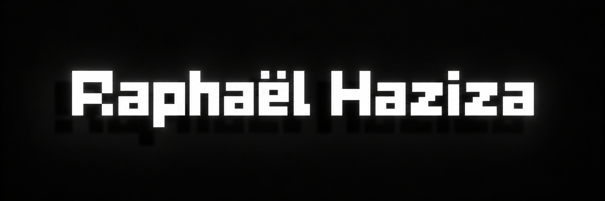

  

# Hi, I'm Raphaël Haziza

I'm a second-year Computer Science student with a strong interest in software development, artificial intelligence, and emerging technologies.

I enjoy building small applications and tools that solve practical problems, whether for myself or for other people. I mainly work with Verse in UEFN, but I'm also comfortable with Python, JavaScript, HTML/CSS, C, and Java.

I'm particularly interested in LLMs, AI agents, and automation, and I like exploring how these technologies can be integrated into useful software.

## Interests

- Frontend development
- Artificial intelligence
- LLMs and AI agents
- Automation
- Practical software tools
- New and emerging technologies
